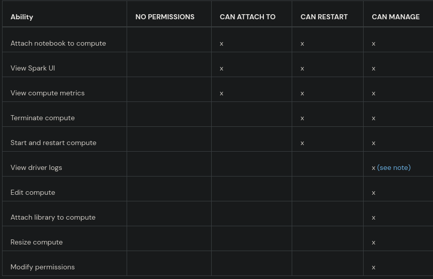

## Configuração de Permissões no Databricks com Terraform

Este documento descreve o processo de configuração de permissões de clusters no Databricks usando Terraform. O código cria permissões específicas para um cluster existente, atribuindo níveis de acesso a grupos e usuários específicos.

### Pré-requisitos:

1 - **Databricks Workspace:** Certifique-se de ter um workspace no Databricks já configurado.

2 - **Cluster Existente:** O processo exige que um cluster já exista no Databricks.

3 - **Terraform:** Instale a última versão do Terraform (>= 1.0).

4 - **Credenciais:** Tenha o token de acesso (databricks_token) e o URL do Databricks (databricks_host).

5 - **Permissões Necessárias:** As permissões de administrador no workspace para poder atribuir permissões de acesso.

### Tipos de permissão:

### Adicionar um grupo ou usuário:

- Informar o **user_name** ou **group_name**
- Passar o nível de permissão (conforme imagem acima)

Há duas configurações de permissões:

- Acesso Administrativo para um usuário específico.
- Acesso Completo para grupos de engenheiros e analistas.

### Verificação das Permissões

Após aplicar o código, você pode verificar se as permissões foram configuradas corretamente diretamente no Databricks:

- Acesse o workspace do Databricks.
- Navegue até o cluster mencionado (Development Cluster).
- Verifique as permissões configuradas.